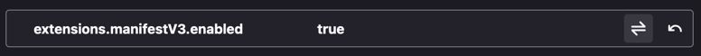
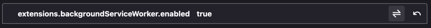
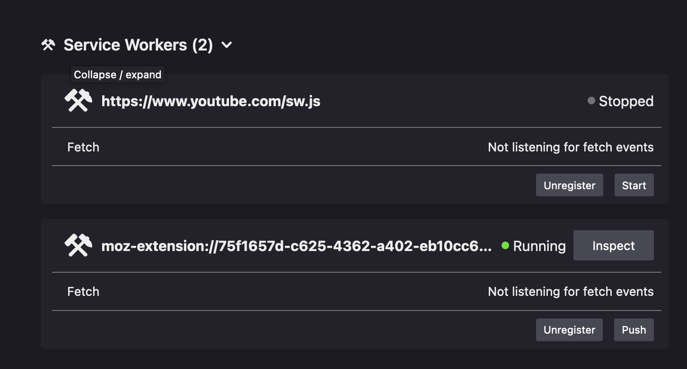

## MV3

Starting in January 2023, Google says all MV2 extensions will no longer work.
Since March 2022 the use of manifest version 2 is listed in the errors tab of an
extension while developing.

Despite this, not all browsers support MV3 yet and there is still a lot of debate.
Apple and Mozilla seem to have put their weight behind an alternate proposal:
https://github.com/w3c/webextensions/issues/134

In any case, it seems refactoring to support ephemeral background pages will be similar
whether it's a `service worker` or event page (Safari on iOS does not support persistent
background pages)

In Google's version of MV3 (likely to win out), the background page is replaced
with a [service worker](https://w3c.github.io/ServiceWorker/) which no longer includes
localStorage. The coil extension makes extensive use of it, for persisting state
and communicating between components (via the `storage` event, a workaround for a
bug in Safari cross component messaging (since fixed)).

### Browser Compatibility

| Browser          |  Compatibility |   Last Checked |                                                                          Link/Notes |
| :--------------- | -------------: | -------------: | ----------------------------------------------------------------------------------: |
| Chrome           |          Works |                |                                                                                     |
| Samsung Internet | September 2022 | June 13th 2022 |                                                                                     |
| Safari           |        Unknown |                |                                                                                     |
| Edge             |        Unknown |                |                                                                                     |
| Opera            |        Unknown |                |                                                                                     |
| Firefox          |    Not Working |      June 27th | https://blog.mozilla.org/addons/2022/05/18/manifest-v3-in-firefox-recap-next-steps/ |
| Firefox Nightly  |        Working | June 27th 2022 |                                                                                     |

### Development notes

To build for MV3, just export a truthy `MV3` env value and build the extension as normal:

```bash
MV3=1 yarn dev-chrome-prod # or yarn dev-firefox-prod
```

#### Firefox notes

As of the time of writing, I could only get MV3 to work in FF nightly (103.0a1 (2022-06-26) (64-bit)

There are 2 settings that must be configured in `about:config` first:

- `extensions.manifestV3.enabled`
  - 
- `extensions.backgroundServiceWorker.enabled`
  - 

You must check the id of the loaded extension and then look in the service workers section to `inspect`


The reloader doesn't seem to work with Firefox because each time the extension is reloaded a new service
worker id is assigned in the debugger, e.g. `about:devtools-toolbox?id=b8f92339-f8c3-40cc-b551-cb2705e7ebce&type=worker`

#### Starting/Stopping service workers in Chrome

Check the id of the extension and look for it in the list of service workers
at `chrome://serviceworker-internals/`. From there you can see the status/logs
and have the ability to start/stop the worker.

### TODO

- [x] Support MV3 in main by modifying webpack config to output MV3 manifest
      and include a backgroundMV3.ts in the `entry`.
- [x] Add a websocket server to webpack plugin that extension can receive
      reload commands from.
- [ ] Use chrome.action instead of chrome.browserAction
- [ ] move listeners to top level
  - [ ] async BackgroundScript is going to be hard
- [ ] Replace `<script>` injection with another method
  - [x] research alternatives
    - see: https://developer.chrome.com/docs/extensions/reference/scripting/#type-ExecutionWorld
    - see: https://github.com/Danisco212/InjectionMV3
- [ ] Replace localStorage
  - the popup is actually already factored well with storage access
    encapsulated
  - the background/contents scripts are likewise in somewhat decent shape
    with Storage injected
  - what is stored in local storage?
    - check the storage keys list
    - anonymous tokens
    - tokens
    - monetization state for the popup
- [ ] ilp-plugin-btp
  - References window.crypto
  - [x] ready [pull request](https://github.com/interledgerjs/ilp-plugin-btp/pull/72)
  - [ ] merge
  - [ ] publish
- [ ] ilp-protocol-stream
  - References window.crypto
  - [x] ready [pull request](https://github.com/interledgerjs/interledgerjs/pull/291)
  - [x] merge fix
  - [ ] publish
- [ ] Workaround inability inject handler.html as iframe into background page
  - SuperTokens cookie auth should solve this
  - Can also open a tab to coil.com to steal the token
