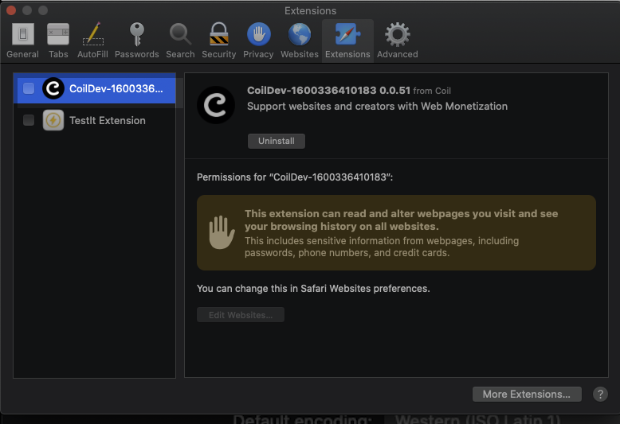

# Safari

### Build safari project after webpack

```
export AFTER_DONE_SHELL_CMD="./scripts/build-safari.sh"
pnpm dev-chrome-prod
```

### Loading unsigned extensions

- First enable the Develop menu:
  Preferences -> Advanced
  
- Then:
  Develop -> Allow Unsigned Extensions
  
- Then toggle the extension:
  Preferences -> Extensions
  

### Debugging

- Enable debugging:
  Develop -> Web Extension Background Pages
  
